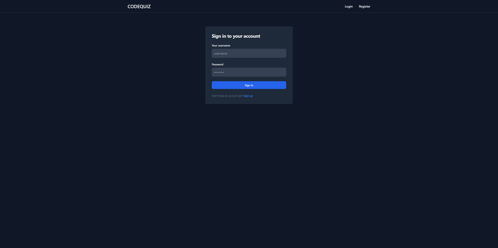
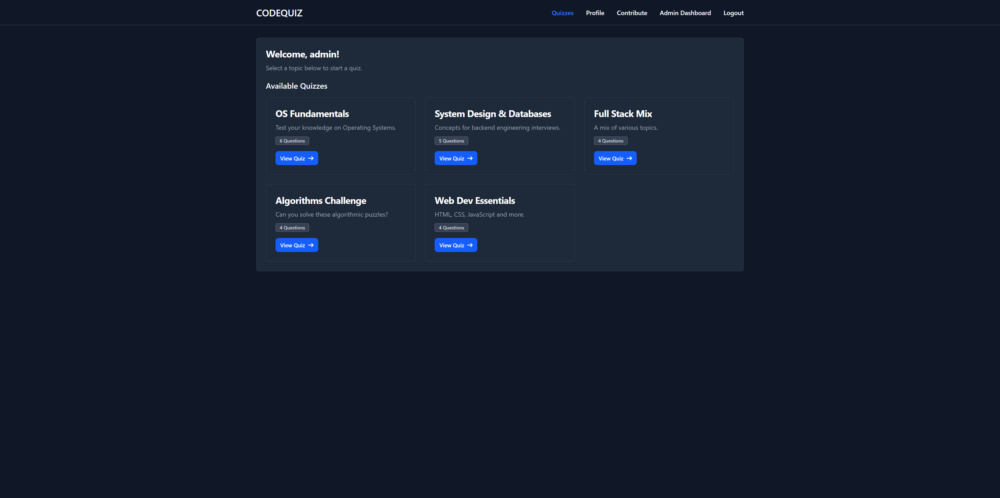
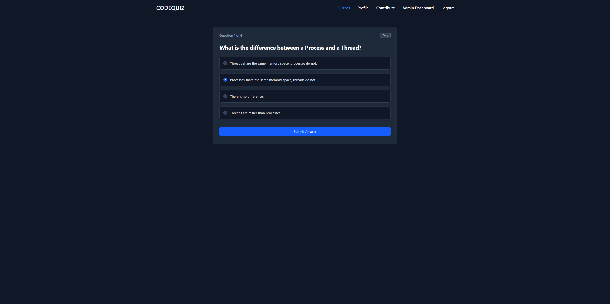
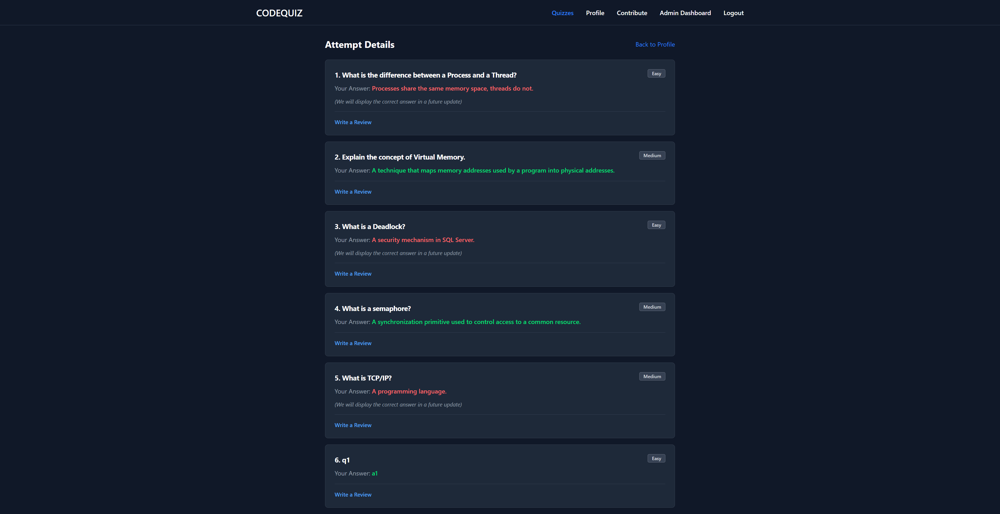
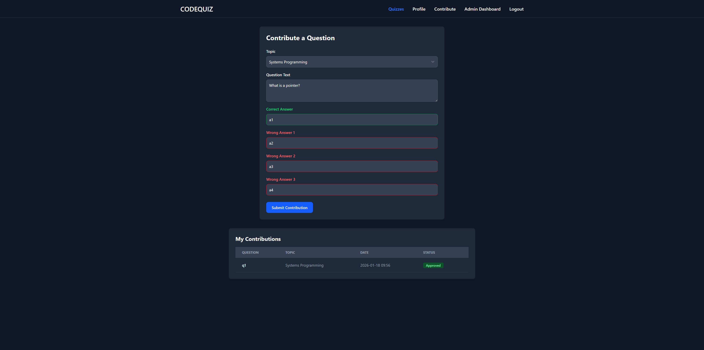
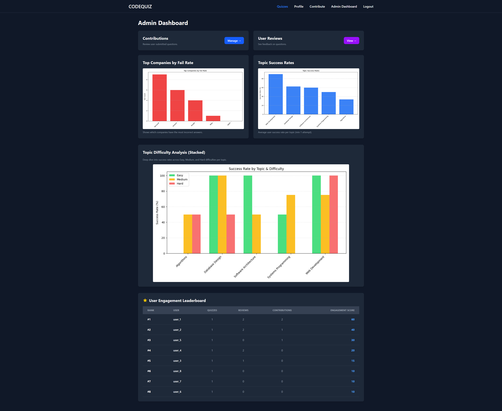
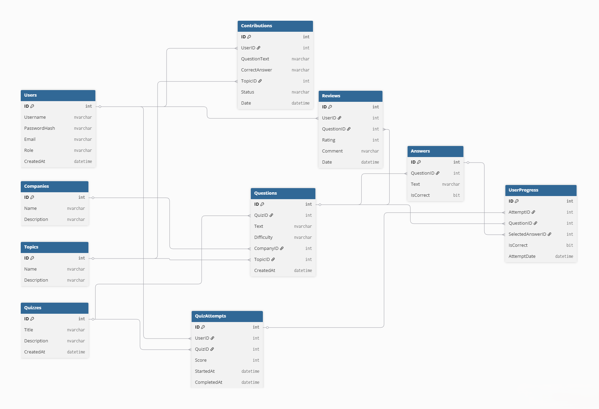
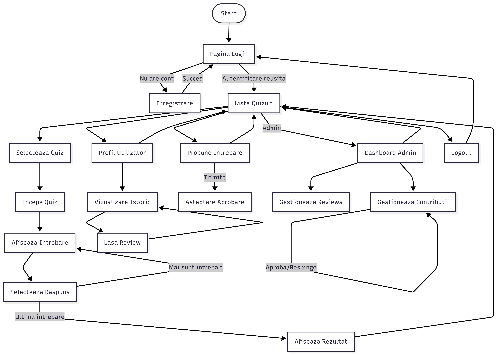
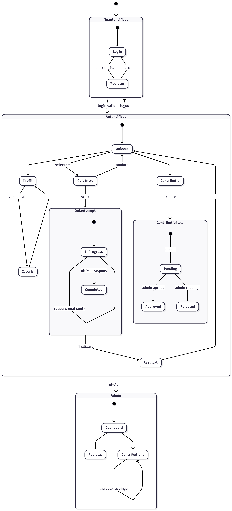

# CodeQuiz Setup Guide

## About CodeQuiz

CodeQuiz is a web-based platform to test programming knowledge and IT concepts. It provides a structured environment for users to answer quizzes, track progress, and contribute content.
Features include:

- User authentication and registration
- Taking quizzes with multiple-choice questions
- Viewing history and personal progress
- Contributing new questions (admin approval)
- Providing reviews for questions
- Admin dashboard with graphical reports and statistics

The backend is Python with Flask and uses MSSQL Server (SQL Server) via pyodbc. The frontend leverages Tailwind CSS and Flowbite. The project uses 10 relational tables with stored procedures for data access and also generates server-side charts with matplotlib. Documentation and diagrams are included in the docs folder.

Diagrams and documentation

- ER diagram, class diagram, and workflow diagrams are provided in the docs folder. Images below illustrate the UI and database structure.

## Screenshots

Here are visual references for the app:











In addition, you can view the full project documentation in the docs/documentation.pdf and the accompanying TeX-derived materials in the same folder.

## 1. Database Setup (Docker)

Install Microsoft SQL Server 2019 using the official image.

### Pull the image

```bash
docker pull mcr.microsoft.com/mssql/server:2019-latest
```

### Run the container

```bash
 docker run -e "ACCEPT_EULA=Y" -e "SA_PASSWORD=parolaAiaPuternic4!" -p 1433:1433 --name sql1 -h sql1 -d mcr.microsoft.com/mssql/server:2019-latest
```

### Connect (Optional)

To access the SQL command line interface inside the container:

```bash
docker exec -it sql1 "bash"
/opt/mssql-tools/bin/sqlcmd -S localhost -U SA -P "parolaAiaPuternic4!"
```

## 2. Application Setup

### Python Dependencies

Install the required Python packages:

```bash
pip install -r requirements.txt
```

### Node.js Dependencies

Install the frontend dependencies for Tailwind CSS and Flowbite:

```bash
npm install
```

## 3. CSS Compilation

Compile the Tailwind CSS to generate the stylesheet:

```bash
npx tailwindcss -i ./static/src/input.css -o ./static/dist/output.css
```

## 4. Database Initialization

To create the tables, stored procedures, and seed the database with initial data, run the reset script:

```bash
python reset_db.py
```

## 5. Run the Application

Start the Flask application:

```bash
python app.py
```

Access the app at `http://127.0.0.1:5000`.

## Admin Test Account

After seeding the database, you can log in with the following admin account:

- Username: `admin`
- Password: `admin123`

## Optional: Development Mode

### Watch for CSS Changes

If you plan to modify the CSS styles during development, run this command to automatically recompile on changes:

```bash
npx tailwindcss -i ./static/src/input.css -o ./static/dist/output.css --watch
```
